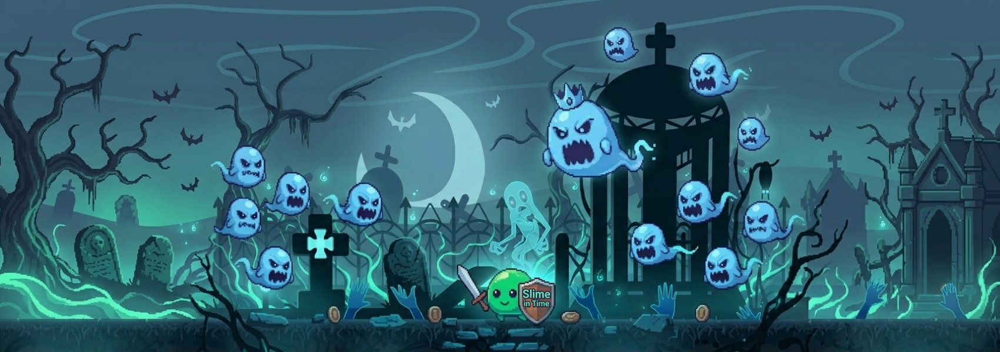
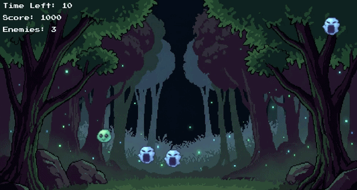

# 🎮 Slime in Time

Slime in Time é um jogo 2D desenvolvido com Python e Pygame como parte da minha jornada de aprendizado em desenvolvimento de software.

No jogo, você controla um slime que precisa sobreviver pelo maior tempo possível enquanto foge de slimes fantasmas que aparecem gradualmente pelo mapa. Conforme o tempo passa, a dificuldade aumenta e a sobrevivência se torna cada vez mais desafiadora.

---

## 🧠 Sobre o projeto

Este projeto foi criado com foco em aprendizado prático de programação e desenvolvimento de jogos.

Ao longo do desenvolvimento, procuro aplicar conceitos de programação orientada a objetos, organização de código e arquitetura de sistemas simples para jogos.

Além de aprender Python e Pygame, o objetivo é construir um projeto cada vez mais completo para compor meu portfólio como desenvolvedor.

---

## 🕹️ Funcionalidades atuais

- Menu inicial
- Sistema de estados do jogo (Menu, Jogando, Vitória e Game Over)
- Controle de personagem
- Inimigos com perseguição ao jogador
- Spawn progressivo de inimigos
- Sistema de colisão
- Sistema de vida do jogador
- Invencibilidade temporária após receber dano (I-Frames)
- Sistema de pontuação
- Temporizador de sobrevivência
- Condição de vitória
- Reinício da partida sem fechar o jogo
- Efeito de parallax para o cenário
- Sistema de partículas/rastro do personagem
- Contador de FPS para depuração
- HUD completa com:
  - Vida
  - Barra de vida
  - Pontuação
  - Tempo restante
  - Quantidade de inimigos
  - FPS
- Sistema de Camera Shake ao receber dano
- Sistema de Knockback suave

---

## 🛠️ Tecnologias utilizadas

- Python
- Pygame

---

## 🚧 Estado atual

O projeto continua em desenvolvimento.

Próximas funcionalidades planejadas:

- Escudo expansível
- Sistema de habilidades
- Bomba temporizada
- Melhorias na barra de vida
- Sons e efeitos sonoros
- Música de fundo
- Novos tipos de inimigos
- Melhorias visuais

---

## 🎯 Objetivo

O principal objetivo deste projeto é desenvolver minhas habilidades como programador através da criação de um jogo completo.

Além da parte técnica, estou utilizando este projeto para praticar organização de código, resolução de problemas, depuração de erros e boas práticas de desenvolvimento.

---

## 📚 O que aprendi

Durante o desenvolvimento deste projeto pratiquei e aprendi conceitos importantes como:

- Estrutura de Game Loop
- Programação Orientada a Objetos (POO)
- Organização de projetos em múltiplos arquivos
- Controle de estados do jogo
- Sistema de colisão utilizando Pygame
- Gerenciamento de entidades
- Sistema de spawn baseado em tempo
- Manipulação de sprites e animações
- Criação de HUDs
- Controle de tempo com `pygame.time.get_ticks()`
- Sistemas de vida e dano
- Invencibilidade temporária (I-Frames)
- Separação de responsabilidades entre classes
- Depuração e correção de bugs
- Refatoração de código sem alterar o comportamento do jogo
- Organização da renderização em módulos especializados
- Arquitetura baseada em responsabilidades
- Separação entre lógica do jogo e renderização
- Estruturação de código para facilitar manutenção e expansão

---

## 📌 Status

Projeto ativo e em constante evolução.
